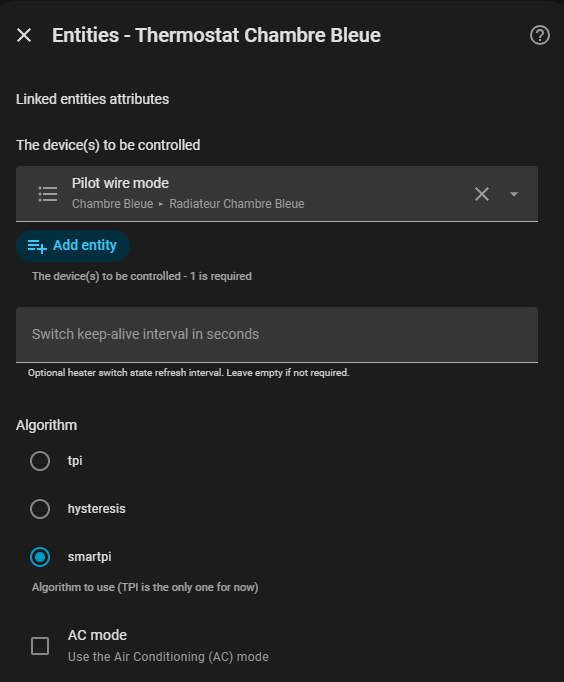
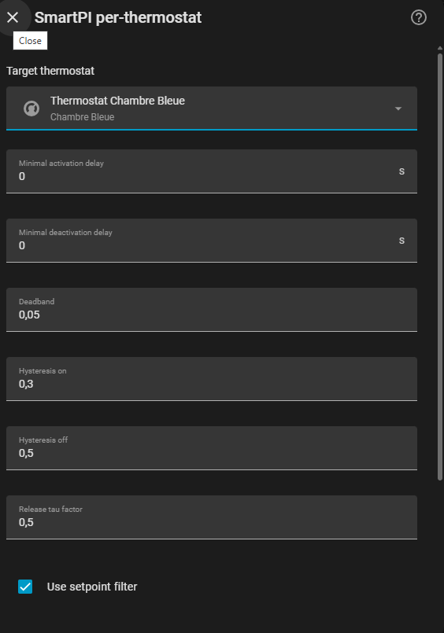

# SmartPI

- [SmartPI](#smartpi)
  - [What SmartPI does](#what-smartpi-does)
  - [Before you start](#before-you-start)
  - [Setup](#setup)
    - [Selecting SmartPI in Versatile Thermostat](#selecting-smartpi-in-versatile-thermostat)
    - [Configuring SmartPI](#configuring-smartpi)
      - [Per-thermostat configuration](#per-thermostat-configuration)
  - [Radiator valves and curve linearization](#radiator-valves-and-curve-linearization)
    - [Why a valve can be hard to regulate](#why-a-valve-can-be-hard-to-regulate)
    - [What linearization does](#what-linearization-does)
    - [When to enable it](#when-to-enable-it)
    - [Choosing the values](#choosing-the-values)
  - [Operating phases](#operating-phases)
    - [Learning phase](#learning-phase)
    - [Stable phase](#stable-phase)
    - [Automatic recalibration](#automatic-recalibration)
  - [Recommended settings](#recommended-settings)
  - [Configuration](#configuration)
  - [Diagnostics and Markdown card](#diagnostics-and-markdown-card)
  - [Services](#services)

## What SmartPI does

SmartPI is an alternative to the classic TPI algorithm for Versatile Thermostat.

Its goal is simple: instead of using fixed behavior, it learns how your room really heats up and cools down, then adjusts regulation automatically.

In practice, SmartPI learns:

- how strongly your heating system warms the room,
- how quickly the room loses heat,
- how long the room takes to react after heating starts or stops.

From that, SmartPI builds a heating command that is usually more precise than a fixed TPI:

- it corrects the current temperature error,
- it estimates the power needed to hold the target,
- it applies protections near the setpoint to reduce overshoot and limit unnecessary oscillations.

You do not need to understand PI control theory to use SmartPI effectively. The important idea is simply that SmartPI needs a first learning period before it can regulate in its normal mode.

## Before you start

For SmartPI to learn correctly, make sure the thermostat has:

- a reliable indoor temperature,
- an outdoor temperature source,
- enough time to observe normal heating and cooling behavior.

For the first learning phase, try to avoid:

- opening windows for long periods,
- major schedule changes,
- unusual heat gains such as strong sun, fireplace use, or many guests,
- changing many SmartPI settings while learning is still in progress.

Two practical recommendations help a lot:

- let SmartPI run without interruption during the first day or two,
- use a setpoint high enough above outdoor temperature for the room to show a clear heating response.

In practice, learning may take from a few hours to 48 hours on slow or highly inertial systems.

## Setup

Install the integration via HACS (or manually) as described in the [README](../../README.md), then restart Home Assistant.

Two steps are required after the restart: selecting SmartPI as the algorithm in Versatile Thermostat, then adding the SmartPI integration in Home Assistant.

### Selecting SmartPI in Versatile Thermostat

Open the configuration of the Versatile Thermostat device you want to control with SmartPI. In the **Underlyings** step, locate the algorithm selector and choose **SmartPI**.

Repeat this step for each thermostat you want to run with SmartPI.

### Configuring SmartPI

Once SmartPI is selected as the algorithm in at least one thermostat, add the **SmartPI** integration in Home Assistant: go to **Settings → Integrations → Add integration**, then search for *SmartPI*.

On first install, SmartPI automatically creates a default configuration entry with sensible defaults. You can edit these global defaults later from **Settings → Integrations → SmartPI → Configure**.

#### Per-thermostat configuration

To add SmartPI to an additional thermostat, open the SmartPI integration configuration and add a new thermostat entry. Select the target thermostat from the list, then adjust the parameters as needed.

The parameters available are the same as for global defaults. Any parameter set here overrides the corresponding global default for the selected thermostat only.

## Radiator valves and curve linearization

This section only applies to thermostats that directly drive a valve, for example a radiator TRV.

### Why a valve can be hard to regulate

A radiator valve does not always behave like an electric heater.

With an electric heater, asking for `40%` usually gives about twice as much heat as asking for `20%`. With many radiator valves, the response is less regular: the first few percent may do almost nothing, then a small extra opening can let a lot of hot water through.

On some installations, a valve can already pass most of the flow when it is only around `20%` open. Opening it further then changes the flow much less.

In practice, it may feel like this:

| Command sent to the valve | Possible radiator effect |
| --- | --- |
| `0%` to a few percent | no visible heat |
| small opening | the radiator just starts heating |
| around `15%` to `25%` | most of the flow is already present |
| above that | smaller change, sometimes mostly more hydraulic noise |

The exact values depend on the valve, the valve body, radiator balancing and the hydraulic installation. Do not try to find a perfect value on the first attempt.

### What linearization does

Valve curve linearization translates the SmartPI demand into a valve position.

SmartPI still works with a simple heating demand:

- `0%` means no heating,
- `50%` means medium demand,
- `100%` means maximum demand.

Linearization then transforms that demand into a valve opening better suited to the real radiator behavior. The goal is to use the small area where the valve really changes the flow more precisely, instead of sending the raw demand directly to the valve.

Simplified example:

| SmartPI demand | Opening sent to the valve |
| --- | --- |
| `0%` | `0%` |
| low demand | around the useful minimum opening |
| `80%` | around the knee opening |
| `100%` | allowed maximum opening |

This correction does not replace SmartPI learning. It only helps SmartPI speak more naturally to a non-linear valve.

### When to enable it

Enable this option if:

- your VTherm thermostat is a valve thermostat,
- SmartPI directly drives a valve opening,
- the radiator seems to go quickly from cold to very hot with only a few percent of opening,
- small command changes create reactions that are too strong or too irregular.

The option is offered only for thermostats that expose a valve command.

### Choosing the values

Default values give a reasonable starting point. Adjust them only if you have observed the behavior of your radiator.

| Parameter | What it means | Starting value |
| --- | --- | --- |
| **Minimum valve opening** | First opening where the radiator really starts heating. | `7%` |
| **Demand at knee** | SmartPI demand where the valve is considered to reach its high-flow area. | `80%` |
| **Valve opening at knee** | Physical valve position at that demand. | `15%` |
| **Maximum valve opening** | Maximum allowed opening. | `100%` |

To find the minimum opening, the simplest method is to observe the radiator:

1. Let the radiator cool down.
2. Start a heating demand.
3. Increase the valve opening slowly, in small steps.
4. Wait at least one minute between attempts.
5. Note the first value where the pipe or radiator really starts warming up.

If you do not want to test carefully, keep the defaults. If your valve reacts very quickly, a knee opening around `20%` to `25%` can be a reasonable trial. If the radiator becomes noisy at full opening, lower the maximum opening.

After changing a value, let SmartPI run for several cycles before judging the result. One heating cycle is not always enough to conclude.

## Operating phases

### Learning phase

SmartPI starts in a bootstrap phase. During this phase, it uses a simple heating strategy to observe how the room behaves, then extracts the physical parameters it needs to regulate properly.

#### How bootstrap heats

During bootstrap, SmartPI does not try to hold the temperature precisely. Instead, it alternates between full heating and full cooling in order to observe clear thermal responses:

- heating starts when the temperature drops below `setpoint - 0.3°C`,
- heating stops when the temperature rises above `setpoint + 0.5°C`.

This produces visible temperature swings which are expected and intentional at this stage.

#### Step 1 — Measuring dead times

The first thing SmartPI needs to learn is **how long the room takes to react** after heating starts or stops. These delays are called *dead times*:

- **heating dead time**: the delay between the moment SmartPI sends a heating command and the moment the indoor temperature starts rising,
- **cooling dead time**: the delay between the moment heating stops and the moment the temperature starts dropping.

Dead times depend on the emitter type, room size, and sensor placement. They must be measured before SmartPI can interpret heating and cooling observations correctly.

#### Step 2 — Learning heat loss (`b`)

Once the dead times are considered reliable, SmartPI starts collecting **cooling observations**: it measures how fast the room loses heat when the heater is off.

From these observations, it calculates `b`, the heat-loss coefficient. This parameter represents how quickly the room cools down depending on the difference between indoor and outdoor temperature.

SmartPI needs at least 8 valid cooling observations before `b` is considered usable.

#### Step 3 — Learning heating gain (`a`)

Once `b` has enough observations to be considered reliable, SmartPI starts collecting **heating observations**: it measures how quickly the room warms up for a given heating command.

From these observations, it calculates `a`, the heating gain. This parameter represents how effectively your heating system raises the indoor temperature.

SmartPI needs at least 6 valid heating observations for `a`.

#### Leaving bootstrap

SmartPI leaves bootstrap and switches to its normal regulation mode once both `a` and `b` have enough observations to publish a first thermal model.

The observation buffers then continue filling up to 31 samples during normal regulation, so the model keeps consolidating after bootstrap. Full model confidence remains stricter than bootstrap exit — until enough observations are available for full confidence, SmartPI regulates with the published model while keeping some internal corrections frozen.

What to expect during bootstrap:

- temperature swings are normal and expected,
- regulation is intentionally simple at this stage,
- diagnostics are especially useful to follow progress,
- speed depends on the quality of real observations, not only on elapsed time.

### Stable phase

When the thermal model becomes reliable, SmartPI switches to its normal regulation mode.

At that point, SmartPI:

- computes PI gains automatically from the learned model,
- adds an anticipative holding term based on the room and outdoor conditions,
- adapts behavior near the setpoint with a deadband and additional protections.

Near the target temperature, SmartPI tries to avoid constant micro-corrections. The result should be steadier regulation with fewer unnecessary corrections than a fixed TPI.

During a heating setpoint increase, the setpoint filter also uses the learned model to manage the final approach to the target. The proportional branch follows a filtered reference, while the raw setpoint remains available to the integral branch. Near the target, SmartPI can cap the internal heating demand when the model predicts that the already injected heat is enough to reach the setpoint. This landing behavior helps the room slow down before the target instead of continuing to heat only because the feed-forward or frozen PI state is still positive.

If the `FF3` option is enabled, SmartPI can also apply a small predictive correction near the setpoint when it detects a credible external disturbance context.

### Automatic recalibration

SmartPI keeps watching the quality of its model over time.

If learning quality stops improving enough, it can trigger an automatic recalibration sequence to refresh the model and dead times.

Useful points to know:

- a reference snapshot is stored once the model becomes reliable,
- a rolling snapshot is refreshed over time,
- if cooling dead time cannot be learned for a long time, SmartPI can still continue with a partial snapshot,
- after repeated unsuccessful recalibration attempts, SmartPI continues to run and reports a degraded model in diagnostics.

## Recommended settings

Default settings are suitable for most installations.

Start simple:

- keep the default hysteresis thresholds,
- keep `FF3` enabled unless you have a specific reason to disable it,
- keep the setpoint filter enabled by default,
- adjust the deadband first if the temperature oscillates too much around the target.

Do not try to tune several parameters at once during the first learning period. It is better to let SmartPI complete a clean first learning cycle, then adjust only what is really needed.

## Configuration

| Parameter | Role | Default value |
| --- | --- | --- |
| **Minimal activation delay** | Minimum time the heater stays on once activated. | `0 s` |
| **Minimal deactivation delay** | Minimum time the heater stays off once deactivated. | `0 s` |
| **Deadband** | Tolerance zone around the setpoint. | `0.05°C` |
| **Setpoint filter** | Enables proportional setpoint shaping and heating landing control near the target. | `enabled` |
| **FF3** | Enables short-horizon predictive correction near the setpoint in disturbance recovery conditions. | `disabled` |
| **Allow P inside deadband** | Allows the proportional branch to remain active inside the deadband. | `disabled` |
| **Release tau factor** | Scales the integral release delay relative to the learned time constant. | `0.5` |
| **Lower hysteresis threshold** | Restart threshold during bootstrap learning. | `0.3°C` |
| **Upper hysteresis threshold** | Stop threshold during bootstrap learning. | `0.5°C` |
| **SmartPI debug mode** | Publishes more detailed diagnostics. | `disabled` |
| **Valve curve linearization** | Adapts SmartPI demand to non-linear radiator valves. | `disabled` |
| **Minimum valve opening** | First useful opening when linearization is enabled. | `7%` |
| **Demand at knee** | SmartPI demand corresponding to the valve slope change. | `80%` |
| **Valve opening at knee** | Physical valve opening at the slope change. | `15%` |
| **Maximum valve opening** | Maximum allowed opening when linearization is enabled. | `100%` |

## Diagnostics and Markdown card

SmartPI publishes its diagnostics directly at the root of the attributes of the SmartPI diagnostic sensor entity.

This is the main place to check:

- whether SmartPI is still learning or already stable,
- whether the model is considered reliable,
- whether recalibration or degraded mode has been reported.

The most useful block during learning is `ab_learning`.

Important fields:

- `stage`: overall state such as `bootstrap`, `learning`, `monitoring`, or `degraded`,
- `bootstrap_progress_percent`: bootstrap progress,
- `bootstrap_status`: current bootstrap step,
- `accepted_samples_a`: validated heating samples,
- `accepted_samples_b`: validated cooling samples,
- `target_samples`: target history size for the full A/B buffers,
- `last_reason`: last learning accept or reject reason.

Other useful blocks in normal mode:

- `control`: current regulation phase and mode,
- `power`: current and next cycle command information,
- `temperature`: measured temperature, error, integral state,
- `model`: learned `a`, `b`, confidence, and dead times,
- `feedforward`: feed-forward and FF3 status,
- `setpoint`: filtered setpoint and landing information,
- `autocalib`: automatic supervision state,
- `calibration`: forced calibration state.

In normal mode, the `setpoint` block can show:

- `filtered_setpoint`: reference followed by the proportional branch,
- `trajectory_active`: whether a setpoint trajectory is active,
- `trajectory_source`: why the trajectory is active,
- `landing_active`: whether heating landing control is active,
- `landing_reason`: reason for the landing state,
- `landing_u_cap`: internal heating-demand cap applied during landing,
- `landing_coast_required`: whether SmartPI is coasting because the model predicts enough stored heat.

If SmartPI debug mode is enabled, the `debug` block adds more detailed internal data, including the landing prediction, target margin, release decision, and command before/after the landing cap.

A Home Assistant Markdown card is also available to display SmartPI diagnostics in a simpler way in the dashboard.

## Services

SmartPI exposes three services in the `vtherm_smartpi` domain.

### `reset_smartpi_learning`

Use this when the thermal behavior of the room has significantly changed, for example after insulation work or after changing emitters.

This service clears SmartPI learning and forces a return to bootstrap mode.

### `force_smartpi_calibration`

Use this when you want SmartPI to run a calibration cycle without waiting for the automatic trigger.

This service is useful when:

- reported dead times seem inconsistent,
- regulation behaves worse than before,
- you want to refresh learning after a significant change in real conditions.

If SmartPI is still in bootstrap mode, the request is ignored.

### `reset_smartpi_integral`

Use this when the integral term has kept an unsuitable value after an exceptional event.

Typical examples:

- a long heating outage,
- a window left open for a long time,
- any situation where you want to keep the learned model but restart from a neutral integral state.
