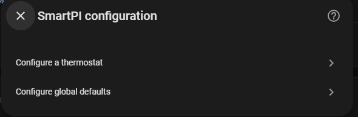

# SmartPI

- [SmartPI](#smartpi)
  - [What SmartPI does](#what-smartpi-does)
  - [Before you start](#before-you-start)
  - [Setup](#setup)
    - [Selecting SmartPI in Versatile Thermostat](#selecting-smartpi-in-versatile-thermostat)
    - [Configuring SmartPI](#configuring-smartpi)
      - [Global defaults](#global-defaults)
      - [Per-thermostat configuration](#per-thermostat-configuration)
  - [Operating phases](#operating-phases)
    - [Learning phase](#learning-phase)
    - [Stable phase](#stable-phase)
    - [Automatic recalibration](#automatic-recalibration)
  - [Recommended settings](#recommended-settings)
  - [Configuration](#configuration)
  - [Diagnostics and Markdown card](#diagnostics-and-markdown-card)
  - [Services](#services)

## What SmartPI does

SmartPI is an alternative to the classic TPI algorithm for Versatile Thermostat.

Its goal is simple: instead of using fixed behavior, it learns how your room really heats up and cools down, then adjusts regulation automatically.

In practice, SmartPI learns:

- how strongly your heating system warms the room,
- how quickly the room loses heat,
- how long the room takes to react after heating starts or stops.

From that, SmartPI builds a heating command that is usually more precise than a fixed TPI:

- it corrects the current temperature error,
- it estimates the power needed to hold the target,
- it applies protections near the setpoint to reduce overshoot and limit unnecessary oscillations.

You do not need to understand PI control theory to use SmartPI effectively. The important idea is simply that SmartPI needs a first learning period before it can regulate in its normal mode.

## Before you start

For SmartPI to learn correctly, make sure the thermostat has:

- a reliable indoor temperature,
- an outdoor temperature source,
- enough time to observe normal heating and cooling behavior.

For the first learning phase, try to avoid:

- opening windows for long periods,
- major schedule changes,
- unusual heat gains such as strong sun, fireplace use, or many guests,
- changing many SmartPI settings while learning is still in progress.

Two practical recommendations help a lot:

- let SmartPI run without interruption during the first day or two,
- use a setpoint high enough above outdoor temperature for the room to show a clear heating response.

In practice, learning may take around 24 to 48 hours before SmartPI can switch to stable regulation. On slow or highly inertial systems, it can take longer.

## Setup

Install the integration via HACS (or manually) as described in the [README](../../README.md), then restart Home Assistant.

Two steps are required after the restart: activating SmartPI in Versatile Thermostat, then adding the SmartPI integration in Home Assistant.

### Selecting SmartPI in Versatile Thermostat

Open the configuration of the Versatile Thermostat device you want to control with SmartPI. In the **Underlyings** step, locate the algorithm selector and choose **SmartPI**.

Repeat this step for each thermostat you want to run with SmartPI.

### Configuring SmartPI

Once SmartPI is selected as the algorithm in at least one thermostat, add the **SmartPI** integration in Home Assistant: go to **Settings → Integrations → Add integration**, then search for *SmartPI*.

A menu appears with two options:

- **Configure global defaults** — sets parameters that apply to all thermostats not individually configured.
- **Configure a thermostat** — sets parameters for one specific thermostat, overriding global defaults for that device.

You can add both types: one global entry and as many per-thermostat entries as needed. Each per-thermostat entry takes priority over global defaults for the selected device.

#### Global defaults

Choose **Configure global defaults** to set fallback values used by every thermostat that does not have its own SmartPI entry.

Default values are suitable for most installations. See the [Configuration](#configuration) section for a description of each parameter.

#### Per-thermostat configuration

Choose **Configure a thermostat** to create a dedicated SmartPI entry for one specific thermostat. Select the target thermostat from the list, then adjust the parameters as needed.

The parameters available are the same as for global defaults. Any parameter set here overrides the corresponding global default for the selected thermostat only.

## Operating phases

### Learning phase

SmartPI starts in a bootstrap phase based on hysteresis.

By default:

- heating starts below `setpoint - 0.3°C`,
- heating stops above `setpoint + 0.5°C`.

During this phase, SmartPI first measures reaction delays, then collects valid heating and cooling observations, then consolidates its thermal model.

As long as the model is not considered reliable enough, SmartPI stays in this learning mode.

What to expect:

- regulation is intentionally simple at this stage,
- diagnostics are especially useful during this phase,
- progress depends on the quality of real observations, not only on elapsed time.

### Stable phase

When the thermal model becomes reliable, SmartPI switches to its normal regulation mode.

At that point, SmartPI:

- computes PI gains automatically from the learned model,
- adds an anticipative holding term based on the room and outdoor conditions,
- adapts behavior near the setpoint with a deadband and additional protections.

Near the target temperature, SmartPI tries to avoid constant micro-corrections. The result should be steadier regulation with fewer unnecessary corrections than a fixed TPI.

If the `FF3` option is enabled, SmartPI can also apply a small predictive correction near the setpoint when it detects a credible external disturbance context.

### Automatic recalibration

SmartPI keeps watching the quality of its model over time.

If learning quality stops improving enough, it can trigger an automatic recalibration sequence to refresh the model and dead times.

Useful points to know:

- a reference snapshot is stored once the model becomes reliable,
- a rolling snapshot is refreshed over time,
- if cooling dead time cannot be learned for a long time, SmartPI can still continue with a partial snapshot,
- after repeated unsuccessful recalibration attempts, SmartPI continues to run and reports a degraded model in diagnostics.

## Recommended settings

Default settings are suitable for most installations.

Start simple:

- keep the default hysteresis thresholds,
- keep `FF3` enabled unless you have a specific reason to disable it,
- keep the setpoint filter enabled by default,
- adjust the deadband first if the temperature oscillates too much around the target.

Do not try to tune several parameters at once during the first learning period. It is better to let SmartPI complete a clean first learning cycle, then adjust only what is really needed.

## Configuration

| Parameter | Role | Default value |
| --- | --- | --- |
| **Deadband** | Tolerance zone around the setpoint. | `0.05°C` |
| **Setpoint filter** | Enables the proportional setpoint shaping near the target. | `enabled` |
| **FF3** | Enables short-horizon predictive correction near the setpoint in disturbance recovery conditions. | `enabled` |
| **Lower hysteresis threshold** | Restart threshold during bootstrap learning. | `0.3°C` |
| **Upper hysteresis threshold** | Stop threshold during bootstrap learning. | `0.5°C` |
| **SmartPI debug mode** | Publishes more detailed diagnostics. | `disabled` |

## Diagnostics and Markdown card

SmartPI publishes its diagnostics directly at the root of the attributes of the SmartPI diagnostic sensor entity.

This is the main place to check:

- whether SmartPI is still learning or already stable,
- whether the model is considered reliable,
- whether recalibration or degraded mode has been reported.

The most useful block during learning is `ab_learning`.

Important fields:

- `stage`: overall state such as `bootstrap`, `learning`, `monitoring`, or `degraded`,
- `bootstrap_progress_percent`: bootstrap progress,
- `bootstrap_status`: current bootstrap step,
- `accepted_samples_a`: validated heating samples,
- `accepted_samples_b`: validated cooling samples,
- `target_samples`: target history size,
- `last_reason`: last learning accept or reject reason.

Other useful blocks in normal mode:

- `control`: current regulation phase and mode,
- `power`: current and next cycle command information,
- `temperature`: measured temperature, error, integral state,
- `model`: learned `a`, `b`, confidence, and dead times,
- `feedforward`: feed-forward and FF3 status,
- `setpoint`: filtered setpoint information,
- `autocalib`: automatic supervision state,
- `calibration`: forced calibration state.

If SmartPI debug mode is enabled, the `debug` block adds more detailed internal data.

A Home Assistant Markdown card is also available to display SmartPI diagnostics in a simpler way in the dashboard.

## Services

SmartPI exposes three services in the `vtherm_smartpi` domain.

### `reset_smartpi_learning`

Use this when the thermal behavior of the room has significantly changed, for example after insulation work or after changing emitters.

This service clears SmartPI learning and forces a return to bootstrap mode.

### `force_smartpi_calibration`

Use this when you want SmartPI to run a calibration cycle without waiting for the automatic trigger.

This service is useful when:

- reported dead times seem inconsistent,
- regulation behaves worse than before,
- you want to refresh learning after a significant change in real conditions.

If SmartPI is still in bootstrap mode, the request is ignored.

### `reset_smartpi_integral`

Use this when the integral term has kept an unsuitable value after an exceptional event.

Typical examples:

- a long heating outage,
- a window left open for a long time,
- any situation where you want to keep the learned model but restart from a neutral integral state.
